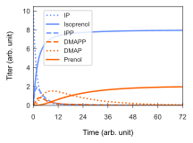

# Repass Kinetic Modeling

This notebook describes a reaction network in which two phosphatases, an isomerase, and a kinase generate terminal C5 alcohols from either IP or IPP. The reaction network has 16 rate constants (Vm/Km) for 8 reactions, 4 substrates, and 2 products. All reactions are assumed 1st-order. Reaction constants may  be directly adjusted according to emprical values. 

### Inputs:
- User defines whether they want to model the OriMVA-Repass or the IPP-Repass
- Pathway selection results in a different initial condition of 10 arb. units of IPP or IP, for the OriMVA and IPP-Repass pathways, respectively
### Outputs:
- Two .csvs of the pvalues and Spearman rank correlation coefficients of each parameter
- Heatmaps of the pvalues and coefficients
- An example plot of the model given input parameters provided
    - Users can also tune parameters for different example plots

#### Example output

- IPP-Repass pathway with randomized parameters

